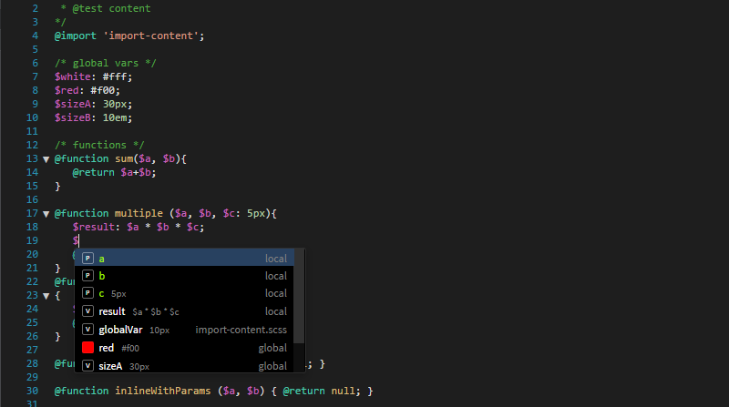
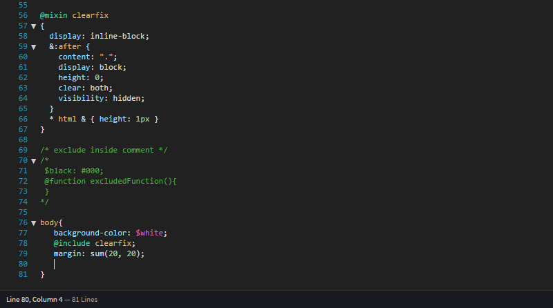
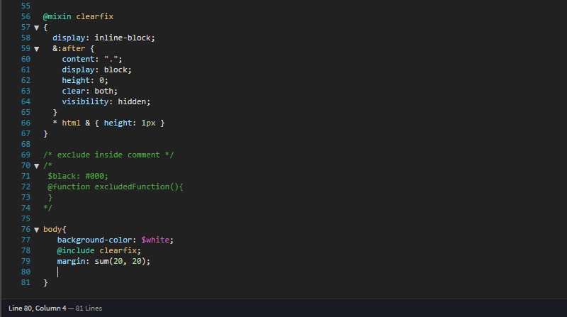

# Sass code hints for Brackets
An extension for [Brackets](https://github.com/adobe/brackets/) to show SASS hints in the code editor.

### How to Install
1. Select **Brackets > File > Extension Manager...**
2. Search for this extension.
3. Click on the **Install** button.

### How to Use Extension
- Keywords, Variables, Mixins
  - Type **`$`** or **`@`** to show respectively variables or keywords hint
  - Type **`@include `** to show mixins hint
  - Press **`Ctrl+Space`** near the variable/mixin/keyword to show hint list
- Functions, Parameters
  - Press **`Ctrl+Shift+Space`** to show functions hint list. If cursor is between function parentheses, it shows parameters hint
  
### Support
Currently only SCSS file format is supported.

### Extension Preferences

**`codehint.SassHint`** *(boolean)* 
If the value of this preference is `true`, sass hints will be enabled.
Otherwise, the extenion will be disabled.

**`sasscodehints.maxHints`** *(number)* 
This value determines maximum length of hint list.

**`sasscodehints.showBuiltFns`** *(boolean)* 
This value define, whether built-in functions will be shown in hint list or not.

**`sasscodehints.commonLibs`** *(string)* 
Absolute path to the common "partial" files. 
When we import files by *@import 'file'* the extension firstly looking for a file in directory relative to edited file. If they not exists, script will continue searching in directory, which was passed by *commonLibs* preference.

For more information on setting preferences see [How to Use Brackets - Preferences](https://github.com/adobe/brackets/wiki/How-to-Use-Brackets#preferences)

### Screenshots
 
*parameters and local / global variables example*

 
*keywords and mixins example*

 
*functions example*

### Planned development
1. Jump to definition

### License
MIT-licensed -- see `main.js` for details.

### Compatibility
Tested on Brackets 1.9 and 1.10 pre-release 2 (Windows 7).